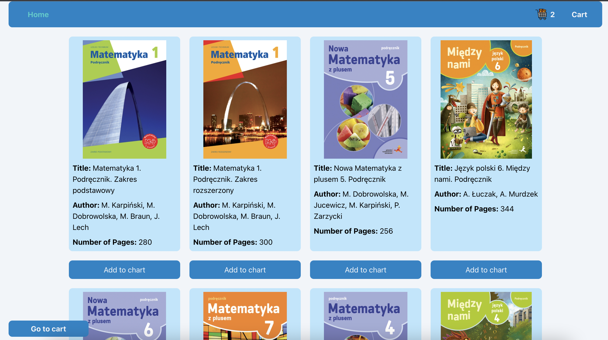
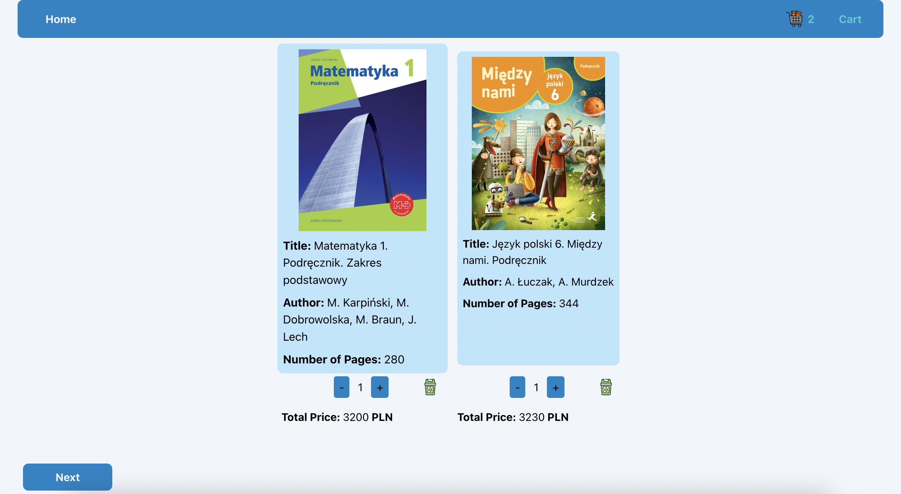
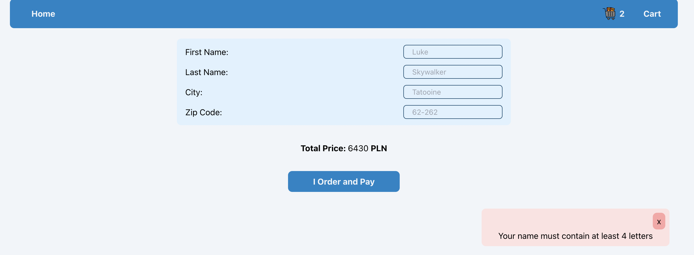

A React app is created with a mock server. 

Tech used: React, TypeScript, TailwindCSS

The mock server is a copy.

You can use the App by forking and cloning the repo.

* After cloning, you should install both api and front folders 
* start in the api folder with npm start
* start in the front folder with npm start
* You can see the App in your browser.

